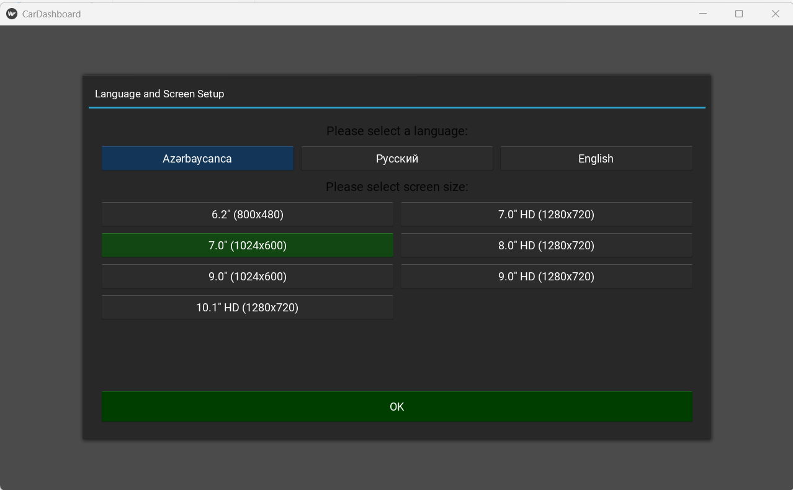

# CarE - OBD-II Car Dashboard

A comprehensive Android OBD-II dashboard application for real-time vehicle monitoring and diagnostics, specifically optimized for Kia Sorento 2003 models.

---

## 📥 Download

| Version | File           | Download Link                                                                 |
|---------|---------------|-------------------------------------------------------------------------------|
| v2.0    | CarE_v2.0.apk | [Download](https://github.com/RashadGarayev87/OBD/releases/download/v2.0/CarE_v2.0.apk) |
| v3.0    | CarE_v3.0.apk | [Download](https://github.com/RashadGarayev87/OBD/releases/download/v3.0/CarE_v3.0.apk) |
| v4.0    | CarE_v4.0.apk | [Download](https://github.com/RashadGarayev87/OBD/releases/tag/v4.0) |

---
---

## ⚠️ Important Note
This application is designed **only for vehicles and Android devices with compatible displays**.  
It **does not work** on PCs, tablets without OBD-II support, or non-Android devices.

## 🖼 Screenshots

**Language & Screen Size Selection:**  

**Main GUI Dashboard:**  

---

## 🚗 Features

### 📊 Real-time Dashboard
- **Analog Gauges**: Beautiful RPM and Speed gauges with gear position display  
- **Live Sensor Data**: Coolant temperature, engine load, MAF rate, fuel levels  
- **Trip Monitoring**: Dual trip tracking (Trip A & Trip B) with fuel consumption  
- **Gear Position**: Automatic gear detection based on RPM and speed  

In upcoming versions of CarE, we plan to introduce advanced features powered by Machine Learning and Computer Vision, including:

📊 Driving Statistics & Analytics using ML for smarter insights

🎥 USB Camera Integration to enable dashcam functionality

🚦 Traffic Sign Recognition with real-time alerts

🚗 Vehicle Distance Warning (safe following distance detection)

🚶 Pedestrian Detection for improved road safety

⚠️ Forward Collision / Hazard Warnings to notify the driver of potential dangers ahead

These features will make CarE not only a monitoring app but also a driver assistance system.
### 🔧 Diagnostics
- **Error Code Reading**: Read and clear DTC (Diagnostic Trouble Codes)  
- **Comprehensive Sensor Data**: 25+ different sensor readings  
- **Real-time Monitoring**: Continuous vehicle parameter monitoring  

### 📈 Statistics & Analytics
- Fuel consumption tracking (instant and average)  
- Trip distance and total distance monitoring  
- Graphical analysis (fuel consumption and distance charts)  
- Export data to CSV for further analysis  

### 🌐 Multi-language Support
- Azerbaijani (default)  
- Russian  
- English  

### 📱 Multi-screen Support
Optimized for:  
6.2" (800x480), 7.0" (1280x720 / 1024x600), 8.0" (1280x720),  
9.0" (1024x600 / 1280x720), 10.1" (1280x720)

---

## 🛠 Technical Specifications

### Supported Protocols
- ISO 14230-4 KWP (5 baud init)  
- ISO 14230-4 KWP (fast init)  
- ISO 9141-2  
- AUTO - Automatic protocol detection  

### Sensor Support
- Engine RPM & Vehicle Speed  
- Coolant Temperature & Engine Load  
- MAF (Mass Air Flow) Rate  
- Fuel Pressure & Fuel Level  
- Throttle Position & Timing Advance  
- Intake/Ambient Temperature  
- Oxygen Sensor & Barometric Pressure  
- Voltage & Engine Runtime  
- Distance Tracking  
- And more...  

---

## 📋 Requirements

**Hardware**  
- Android device 5.0+ (API 21+)  
- ELM327 WiFi adapter only  
- Compatible vehicle (Kia Sorento 2003 optimized)  

**Software**  
- Android 5.0 or higher  
- WiFi connectivity  
- OBD-II port access  

---

## 🔌 Installation

### APK Installation
1. Download the APK from the [releases](../../releases) page  
2. Enable **Install from unknown sources** in Android settings  
3. Install the APK file  
4. Launch CarE application  

### OBD-II Setup
1. Connect your ELM327 adapter to the vehicle's OBD-II port  
2. Connect your Android device to the adapter via WiFi  
3. Launch CarE app  
4. Select language and screen size  
5. The app will auto-detect and connect to the adapter  

---

## 🎮 Usage

- **Dashboard**: Analog RPM & Speed gauges, gear indicator, live sensor data  
- **Statistics**: Fuel and distance analytics  
- **Error Codes**: Read/clear DTCs  
- **Sensors**: List of available sensor data  
- **About**: App info and credits  

### Trip Management
- Trip A: Current journey (resettable)  
- Trip B: Total accumulated data  
- Fuel tracking: Real-time calculation  
- Distance: Accurate trip measurement  

---

## 🔧 Technical Details

- **Frontend**: Kivy/KivyMD for cross-platform UI  
- **Backend**: Python 3.8 with socket communication  
- **Database**: SQLite for data persistence  
- **Charts**: Matplotlib for data visualization  

- **OBD-II Communication**: Socket with ELM327, multi-protocol auto-detection  
- **Data Storage**: SQLite + CSV export  
- **Thread-safe**: Real-time safe updates  

---

## 🐛 Known Issues & Limitations
- Optimized specifically for Kia Sorento 2003 (partial support for others)  
- Some sensors may not be available on all vehicles  
- WiFi adapters recommended for stability  
- Requires stable connection  

---

## 🔄 Future Updates
- Additional vehicle profiles  
- Enhanced error code descriptions  
- Data logging/history  
- Customizable dashboard layouts  
- More languages  
- Advanced diagnostics  

---

## 📊 Performance
- RAM: ~150–200MB  
- Storage: ~50MB (with data)  
- Battery: Moderate usage  
- Auto-reconnection + error recovery  

---

## 🤝 Contributing
We welcome contributions!  
1. Fork the repository  
2. Create a feature branch  
3. Make your changes & test  
4. Submit a pull request  

---

## 📢 Feedback
This project is in active development. Your feedback is highly appreciated:  
- Open a new [Issue](../../issues) with details  
- Share your vehicle model and OBD adapter type  
- Attach logs if possible  

---

## 📄 License
Licensed under the MIT License – see [LICENSE](LICENSE) file.  

---

## 👨‍💻 Developer
**Rashad Garayev**  
- Email: garayevrashad@hotmail.com  
- GitHub: [RashadGarayev87](https://github.com/RashadGarayev87)  
- Specialization: Automotive diagnostics & car monitoring apps  

---

## 🙏 Acknowledgments
- Kivy/KivyMD community  
- Python OBD contributors  
- ELM327 protocol documentation  
- Beta testers and contributors  

---

## 📞 Support
- [Issues](../../issues) for bug reports & requests  
- Mention OBD adapter type and vehicle model  
- Provide logs for debugging if possible  

---

**Version:** 1.0 Beta  
**Last Updated:** December 2024  
**Compatibility:** Android 5.0+ (API 21+)  

---
---

## 💖 Donate / Support

If you would like to support the development of **CarE - OBD-II Dashboard** and help keep the project growing, you can make a donation using the bank details below:

**Bank IBAN (AZN):**  
`AZ04BRES41010AZ0441442765001`

Your support is greatly appreciated and helps to continue improving this project 🚀

